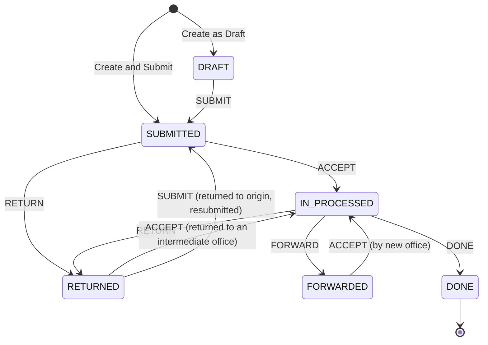

# Document Tracking System (DTS): UI Integration Guide

This guide is for the UI team building the DTS screens. It sits alongside the OpenAPI spec
(`document_tracking_api.yaml` in this folder). The spec lists every field; this guide explains
**which screen calls what, how to decide what to show, and the details that aren't obvious**.

Base URL: `{API}/api/v1`. Every DTS endpoint requires `Authorization: Bearer <jwt>`.

---

## 1. Core concepts (read this first)

| Term | Meaning |
|---|---|
| **Track** | One document (or bundle) being routed between offices. It has a permanent **track number** like `DTS-2026-000001`, assigned by the server. |
| **Office** | A DTS destination office (Accounting Office, Treasury Office, …), configured in Setup Manager. |
| **Office user** | Any user assigned to an office (`users.dts_office_id`). A user belongs to at most one office. |
| **Holder** (`currentOfficeId` / `currentHolder`) | The office that has the document **right now**. Only that office's users can accept, forward, return or complete it. |
| **Origin** (`originOfficeId`) | The creator's office. A track that is returned all the way back lands here. |
| **History** | An append-only log of every movement. It is the source of truth for the timeline and the PDF. |
| **`allowedActions`** | The actions **the current user** may take on this track right now, computed by the server. **Drive your buttons from this.** |

### The single most important rule for the UI
> **Never work out permissions or valid transitions on the client.** Every track response
> includes `allowedActions`. Show a button only if its action is in that array. The server
> enforces the same rules, so a hidden button can never be forced through with a manual call.

---

## 2. Lifecycle



**Where a return goes:** the server sends it back to the office that last sent the track
to the current holder. The client never picks it. Two cases:
- **Returned to an intermediate office** (e.g. Treasury → Accounting): that office sees ACCEPT and continues.
- **Returned to the origin** (e.g. Accounting → Scholarship Office): the creator sees EDIT and SUBMIT, fixes the track, and resubmits.

### Status labels and suggested badge styles

| `status` | Label | Suggested badge |
|---|---|---|
| `DRAFT` | Draft | neutral / gray |
| `SUBMITTED` | Submitted | blue |
| `IN_PROCESSED` | In-Processed | amber |
| `FORWARDED` | Forwarded | purple |
| `RETURNED` | Returned | red / orange |
| `DONE` | Done | green |

---

## 3. Who can do what

| Role / situation | Can |
|---|---|
| `system admin`, `financial assistance coordinator` | Create tracks, and see **all** non-draft tracks. Setup Manager CRUD. (Admin only: assign users to offices.) |
| Track creator | Edit and submit their own draft; edit and resubmit when it's returned to the origin; discard their draft. |
| Users of the **holding office** | ACCEPT / FORWARD / RETURN / DONE, whichever `allowedActions` lists. |
| Users of an office that **previously handled** the track | View it, see its history and print it, read-only. |
| **Students who are grantees** of the track's sponsorship (application `AWARDED`, `DELISTED` or `GRADUATED`) | View it read-only, without internal remarks or staff names (see 4.11). |
| Everyone else (other offices, non-grantee students, sponsors) | Nothing. The track doesn't appear in their list, and direct access is refused. |

Drafts are visible **only to their creator**.

---

## 4. Screen-by-screen API map

### 4.1 App bootstrap: who is the user?
`GET /document-tracks/me` →
```json
{ "userId": "…", "name": "Ana Accounting", "userType": "dts officer",
  "officeId": "…", "officeName": "Accounting Office", "canCreate": false }
```
- Show the **"Create Track"** button only when `canCreate` is `true`.
- If `officeId` is `null` and `canCreate` is `false`, the user has no DTS access. Hide the DTS menu, or show "Your account is not assigned to a DTS office".
- Use `officeName` in the header ("Signed in as … · Accounting Office").

### 4.2 Document Tracking list
`GET /document-tracks?offset=0&limit=20&…`

Response `data`: `{ "data": DocumentTrack[], "total": number }`. List items **don't include `history`**.

| UI control | Query param |
|---|---|
| Search box (track no. or title) | `search` |
| Status tabs: All / Draft / Submitted / In-Processed / Forwarded / Returned / Done | `status=DRAFT` … (omit for All) |
| **"Pending on my office"** tab (the inbox) | `inbox=true` |
| Process Type / Purpose / Sponsorship / Current Office filters | `processTypeId`, `purposeId`, `sponsorshipId`, `currentOfficeId` |
| Created date range | `createdFrom`, `createdTo` (ISO 8601) |
| Submitted date range | `submittedFrom`, `submittedTo` |
| Pagination | `offset`, `limit` (default 50) |
| Sort by created date | `sort=asc\|desc` (default `desc`) |

Suggested columns and their fields: Track No. `trackNumber` · Title `title` · Particulars
`particulars` · Process Type `processType` · Purpose `purpose` · Sponsorship `sponsorshipName` ·
Status `status` · Current Office `currentHolder` · Created By `createdBy.name` · Created At
`createdAt` · Submitted At `submittedAt`.

> **Don't send empty filters.** Send `status` only when a tab is selected. The API rejects
> invalid values (e.g. `status=string`) with a 400.

### 4.3 Create Track form

**Dropdown sources** (any authenticated user can read these). Always pass `active=true` for forms:

| Field | Request | Option value / label |
|---|---|---|
| Type of Process | `GET /document-tracks/setup/process-types?active=true&limit=100` | `id` / `name` |
| Purpose | `GET /document-tracks/setup/purposes?active=true&limit=100` | `id` / `name` |
| Destination | `GET /document-tracks/setup/offices?active=true&limit=100` | `id` / `name` |
| Sponsorship | existing sponsorship endpoint (`GET /sponsorships/coordinator`) | `id` / `name` |

Setup lists return `{ data: SetupItem[], total }`, already sorted by `sortOrder` then name.

**Destination dropdown:** leave out the user's own office (`me.officeId`). The server rejects
sending a track to the office it's coming from.

**Submit** `POST /document-tracks`:
```json
{
  "title": "Batch 1 Scholarship Voucher Processing",
  "particulars": "Scholarship vouchers and supporting documents for Batch 1 grantees",
  "processTypeId": "…", "purposeId": "…", "sponsorshipId": "…",
  "destinationId": "…",
  "submit": false
}
```

| Button | `submit` | Destination |
|---|---|---|
| **Save as Draft** | `false` | optional (saved as the intended destination) |
| **Create & Submit** | `true` | **required** |

Validation to mirror on the client: `title` required (max 255) · `particulars` required ·
`processTypeId`, `purposeId`, `sponsorshipId` required · `destinationId` required only when submitting.

Suggested flow for Create & Submit: confirm first ("This document will be sent to
**{destination name}**"), then on `201` show a success panel with `trackNumber`,
`currentHolder` and `status`, plus **View Track** and **Print Track as PDF** buttons.

> **The track number exists as soon as a track is created, including drafts.** Show it on the draft too.

### 4.4 Track details page
`GET /document-tracks/{id}`: the full `DocumentTrack`, **with `history`**.

Suggested layout:
- **Header:** `trackNumber` and a status badge.
- **"Currently with"** callout: `currentHolder`. This is the office name, or the creator's name while it's a draft or has been returned to a creator who has no office.
- **Document info:** title, particulars, process type, purpose, sponsorship, created by/at, submitted at, completed at.
- **Action area:** render from `allowedActions` (see 4.5).
- **Timeline:** render from `history` (see 4.6).
- **Print Track as PDF:** show when `status !== "DRAFT"` (see 4.7).

After **any** action succeeds, the response is the full updated track, including `history` and
the new `allowedActions`. **Replace your page state with it. There's no need to refetch.**

### 4.5 Action area: buttons and forms

| `allowedActions` contains | Button label | Endpoint | Body | Form fields |
|---|---|---|---|---|
| `EDIT` | Edit | `PUT /document-tracks/{id}` | same shape as Create (`submit` ignored) | the Create form, prefilled |
| `SUBMIT` | Submit, or **Resubmit** when `status === "RETURNED"` | `POST /{id}/submit` | `{ destinationId?, remarks? }` | Destination (defaults to `intendedDestinationId`), optional Remarks |
| `ACCEPT` | In-Process / Acknowledge | `POST /{id}/accept` | `{ remarks? }` | optional Remarks (a confirm dialog is enough) |
| `FORWARD` | Forward | `POST /{id}/forward` | `{ destinationId, remarks }` | **Destination Office \*** (leave out `currentOfficeId`), **Remarks \*** |
| `RETURN` | Return | `POST /{id}/return` | `{ remarks }` | **Return Reason \*** (no destination: the server decides) |
| `DONE` | Mark as Done | `POST /{id}/done` | `{ remarks }` | **Final Remarks / Release Details \*** |

**Discard draft:** show when `status === "DRAFT"` and `allowedActions` includes `EDIT`
(only the creator gets it). Call `DELETE /document-tracks/{id}`.

A single receiver-action form is enough: an **Action** select (built from `allowedActions`)
that shows the Destination field only for FORWARD and makes Remarks required for FORWARD,
RETURN and DONE.

**Required remarks** are trimmed on the server, so whitespace-only remarks are rejected. Mirror that on the client.

### 4.6 Timeline (history)
Each entry (`history[]`, in order, oldest first):
```json
{ "sequence": 4, "action": "FORWARDED", "status": "FORWARDED",
  "fromOffice": "Accounting Office", "toOffice": "Treasury Office",
  "remarks": "For release of funds",
  "actor": { "userId": "…", "name": "Ana Accounting", "office": "Accounting Office" },
  "at": "2026-09-30T12:47:10.000Z" }
```

| `action` | Label | Line |
|---|---|---|
| `CREATED` | Created | `{fromOffice}` |
| `SUBMITTED` | Submitted | `{fromOffice} → {toOffice}` |
| `ACCEPTED` | Accepted / In-Processed | `{toOffice}` (the receiving office) |
| `FORWARDED` | Forwarded | `{fromOffice} → {toOffice}` |
| `RETURNED` | Returned | `{fromOffice} → {toOffice}` |
| `DONE` | Done | `{fromOffice}` |

Show `actor.name` (and `actor.office`), the `at` time, and `remarks` when present.

- `fromOffice` is an **empty string** (not null) when the actor had no office. Fall back to `actor.name`.
- Office and actor names are **snapshots** taken when each action happened. If an office is renamed later, old entries keep the old name. That's intended, for audit accuracy.
- Use `sequence` as the React key; it's unique within a track.
- `GET /document-tracks/{id}/history` returns the same array on its own, if you ever need just the timeline.

### 4.7 Print Track as PDF
`GET /document-tracks/{id}/pdf` returns `application/pdf`. It's only available after submission;
a draft returns 400.

The endpoint needs the `Authorization` header, so **a plain `<a href>` or `window.open(url)`
won't work**. Fetch it as a blob:

```ts
const res = await fetch(`${API}/api/v1/document-tracks/${id}/pdf`, {
  headers: { Authorization: `Bearer ${token}` },
});
if (!res.ok) throw await res.json();           // errors come back as JSON
const url = URL.createObjectURL(await res.blob());
window.open(url);                              // or download it as `${trackNumber}.pdf`
```

### 4.8 Setup Manager › Office Track
Three pages share one API; only the `kind` path segment changes:

| Page | `kind` |
|---|---|
| Process Type | `process-types` |
| Process Purpose | `purposes` |
| Process Destination | `offices` |

| Action | Request | Body |
|---|---|---|
| List (**all**, including inactive; don't pass `active`) | `GET /document-tracks/setup/{kind}?search=&offset=&limit=` | |
| Add | `POST /document-tracks/setup/{kind}` | `{ name, sortOrder?, isActive? }` |
| Edit / toggle active | `PUT /document-tracks/setup/{kind}/{id}` | any of `{ name, sortOrder, isActive }` |
| Delete | `DELETE /document-tracks/setup/{kind}/{id}` | |

Allowed roles for writes: `system admin`, `financial assistance coordinator`.

- **Deactivate** (`isActive: false`) hides a value from form dropdowns but keeps it on existing tracks. Prefer offering this over Delete.
- **Delete** is a soft delete. For offices, it's **refused while the office still holds open tracks**; show the returned message.
- Names are unique per kind. Re-adding a deleted name restores the original record.

### 4.9 Office user assignment (Settings › User Accounts)
- Assign or unassign: `PUT /document-tracks/setup/user-offices/{userId}` with `{ "officeId": "<id>" | null }`, **system admin only**.
- Office roster: `GET /document-tracks/setup/offices/{officeId}/users`.

DTS-only accounts use the **"DTS Officer"** role; create them with the normal user-creation
flow, then assign an office. Any role can be assigned an office.

### 4.10 Notifications
DTS uses the existing notifications module (`GET /notifications`), with `type: "document"`
and `referenceId` set to the **track id**. Route a click to `/document-tracks/{referenceId}`.

| Event | Who is notified |
|---|---|
| Submitted / resubmitted | every user of the destination office |
| Forwarded | every user of the destination office |
| Returned | every user of the office it returns to, or the creator if they have no office |
| Done | the creator, **and every grantee of the track's sponsorship** |

### 4.11 Student view ("Track my documents")
Students use the same endpoints with their own token. No separate API is needed.

| Screen | Request |
|---|---|
| My documents list | `GET /document-tracks` (returns only non-draft tracks of sponsorships the student is a grantee of) |
| Document status | `GET /document-tracks/{id}` |
| Print | `GET /document-tracks/{id}/pdf` (redacted, same as below) |

A student's responses are **redacted**:
- every history entry has `remarks: null` and `actor: null`
- the track has `createdBy: null`
- `currentHolder` never shows a staff name (it falls back to the origin office)
- `allowedActions` is always `[]`

So the student UI should:
- show the **status badge**, the **"Currently with" office** and a **timeline of offices and dates**
- **hide** the action area, the remarks and the actor column
- handle `actor` being `null` in the timeline component if it's shared with staff screens

A student with no grants gets an **empty list** (`{ data: [], total: 0 }`), not an error, so show
an empty state such as "No documents are being processed for your scholarship yet". Students
can't use `inbox=true` (they have no office).

Grantees get **one notification per track, when it's marked Done** (e.g. "…has finished
processing"), not on every office hop.

---

## 5. Responses and errors

### Success envelope
```json
{ "statusCode": 200, "message": "Request Successfully Accepted!", "data": { … }, "generatedAt": 1790771978017 }
```
Create returns `201`. Everything else returns `200`. Paginated lists put
`{ data: [...], total }` **inside** `data`, so the rows are at `response.data.data`.

### Errors: **all are HTTP 400** (a codebase convention), told apart by the body

| `errorMessage` | `errorDetails` | Meaning / suggested UI |
|---|---|---|
| `INVALID-REQUEST` | `{ errors: [{ path, msg, … }] }` (object) | Field validation failed. Map `path` to the form field and show `msg`. |
| `INVALID-REQUEST` | `"…"` (string) | Business rule, e.g. "This action is not allowed for the track's current status". Show it as a toast. |
| `FORBIDDEN` | `"Invalid API Token"` | Missing, malformed or expired JWT. Send the user to login. |
| `FORBIDDEN` | `"Only users of the office currently holding this track…"`, `"You do not have access to this document track"`, `"Only the creator…"`, `"Access denied"` | Permission. Toast, and refetch the track (the UI state is probably stale). |

A generic handler:
```ts
function toUserMessage(body: any): string | Record<string, string> {
  const d = body?.errorDetails;
  if (d && typeof d === 'object' && Array.isArray(d.errors)) {
    return Object.fromEntries(d.errors.map((e: any) => [e.path, e.msg]));   // field errors
  }
  return typeof d === 'string' ? d : 'Something went wrong';
}
```

### Concurrency: "updated by someone else"
If two users act on the same track at once, only one succeeds. The other gets
`"This track was updated by someone else. Reload it and try again"`. **Handle it by refetching
`GET /document-tracks/{id}`** and showing a toast. The new `allowedActions` tell the user what's
still possible.

---

## 6. TypeScript types (matching the API)

These replace the original draft frontend types. The main differences: process type, purpose
and destination are **database-driven** (sent and received as ids, with display names alongside)
instead of hardcoded string unions, and every track carries `allowedActions`.

```ts
export const TRACK_STATUS = {
  DRAFT: 'DRAFT', SUBMITTED: 'SUBMITTED', IN_PROCESSED: 'IN_PROCESSED',
  FORWARDED: 'FORWARDED', RETURNED: 'RETURNED', DONE: 'DONE',
} as const;
export type TrackStatus = typeof TRACK_STATUS[keyof typeof TRACK_STATUS];

export type TrackHistoryAction = 'CREATED' | 'SUBMITTED' | 'ACCEPTED' | 'FORWARDED' | 'RETURNED' | 'DONE';
export type TrackAction = 'EDIT' | 'SUBMIT' | 'ACCEPT' | 'FORWARD' | 'RETURN' | 'DONE';
/** Receiver actions (the subset shown on the receiver form). */
export type ReceiverAction = Extract<TrackAction, 'ACCEPT' | 'FORWARD' | 'RETURN' | 'DONE'>;

export interface TrackActor {
  userId: string;
  name: string;
  office: string;          // '' when the actor has no office
  officeId: string | null;
}

export interface TrackHistoryEntry {
  sequence: number;
  action: TrackHistoryAction;
  status: TrackStatus;
  fromOffice: string;      // '' when none
  fromOfficeId: string | null;
  toOffice: string | null;
  toOfficeId: string | null;
  remarks: string | null; // always null for students
  actor: TrackActor | null; // always null for students
  at: string;              // ISO 8601, UTC
}

export interface DocumentTrack {
  id: string;
  trackNumber: string;
  title: string;
  particulars: string;
  processTypeId: string;
  processType: string;     // display name
  purposeId: string;
  purpose: string;         // display name
  sponsorshipId: string;
  sponsorshipName: string;
  status: TrackStatus;
  currentOfficeId: string | null;
  currentHolder: string;   // office name, or creator name when no office holds it
  originOfficeId: string | null;
  originOffice: string | null;
  intendedDestinationId: string | null;
  intendedDestination: string | null;
  createdBy: { userId: string; name: string } | null; // null for students
  createdAt: string;
  submittedAt: string | null;   // first submission; kept on resubmit
  completedAt: string | null;
  allowedActions: TrackAction[];
  history?: TrackHistoryEntry[]; // present on detail/action responses, absent in lists
}

export interface DocumentTrackPayload {
  title: string;
  particulars: string;
  processTypeId: string;
  purposeId: string;
  sponsorshipId: string;
  destinationId?: string | null;
  submit?: boolean;        // POST only
}

export interface ReceiverActionFields {
  destinationId?: string;  // FORWARD (required), SUBMIT (optional)
  remarks?: string;        // required for FORWARD, RETURN, DONE
}

export interface TrackCurrentUser {
  userId: string;
  name: string;
  userType: string;        // lowercase role name
  officeId: string | null;
  officeName: string | null;
  canCreate: boolean;
}

export interface SetupItem {
  id: string; name: string; sortOrder: number; isActive: boolean;
  createdAt: string; updatedAt: string;
}

export interface Paginated<T> { data: T[]; total: number }
```

**Migrating from the earlier draft types:**

| Old | New |
|---|---|
| `processType: "SCHOLARSHIP_VOUCHER"` | send `processTypeId`; display `processType` |
| `purpose: "FOR_PROCESSING"` | send `purposeId`; display `purpose` |
| `destination: string` (payload) | `destinationId` |
| `sponsorshipName` in payload | not needed (the server looks it up) |
| `currentHolder` | unchanged; `currentOfficeId` added |
| permission checks on the client | use `allowedActions` |

---

## 7. Gotchas checklist

- [ ] Buttons come from `allowedActions`, never from status + role logic on the client.
- [ ] After an action, use the returned track as the new state; don't refetch.
- [ ] Dropdowns use `?active=true`; Setup Manager lists don't.
- [ ] The destination dropdown leaves out the current/own office.
- [ ] RETURN has no destination field.
- [ ] The PDF is fetched as a blob with the auth header, not as a plain link.
- [ ] Paginated rows are at `response.data.data`.
- [ ] Every error is HTTP 400. Branch on `errorMessage` and the type of `errorDetails`.
- [ ] Timestamps are UTC ISO strings. Display them in local time (Asia/Manila).
- [ ] List items have no `history`; the detail page does.
- [ ] Drafts only ever appear for their creator.
- [ ] In the student view, `actor`, `remarks` and `createdBy` are `null`. Don't crash on them.

---

## 8. Testing against a local API

The backend has a one-command setup that creates test office users and prints their tokens and
all the ids you need:

```bash
npm run dts-test-setup            # accounts, 30-day tokens, office/process/purpose/sponsorship ids
npm run dts-test-setup -- --reset # also deletes the test coordinator's tracks
```

| Account (password `password123`) | Office | Use it to |
|---|---|---|
| `dts.coordinator` | Scholarship Office | create, submit, resubmit |
| `dts.accounting` | Accounting Office | receive, forward, return, complete |
| `dts.treasury` | Treasury Office | receive a forwarded track |
| `dts.budget` | Budget Office | check that an uninvolved office is blocked |
| `dts.student` | none (grantee of **DTS Test Sponsorship**) | the student's read-only, redacted view |

Create test tracks with the printed **DTS Test Sponsorship** id, so marking them Done notifies only
`dts.student`, not real grantees.

A happy-path click-through: coordinator creates and submits to Accounting → accounting accepts
and forwards to Treasury → treasury accepts and returns it → accounting accepts again and marks
it done → anyone involved prints the PDF.
